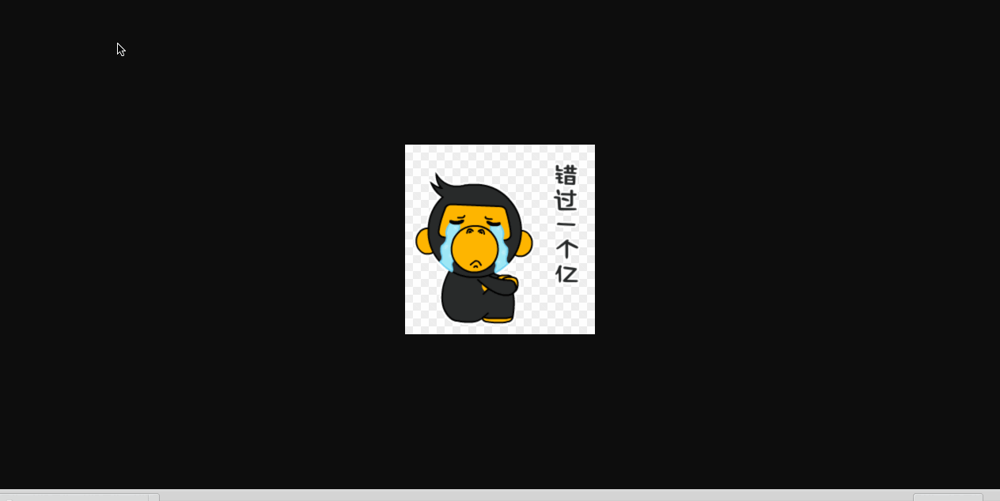

文件下载最常见的情况只需要将目标链接指向下载文件即可，如下代码所示：

```
<a href="files/img.gif">下载2</a>
```

右键选择 `链接存储为`，可以将图片下载保存，如图所示


当前情况下如果单击 `下载2` 那么在下载一些文件比如图片或者word文档时，会直接在浏览器中打开这些文件，如下图所示：



----

下面是如何在单击下载链接之后出现下载框的步骤：

首先将链接目标定位为另一个 `jsp` 这里是 `download.jsp`

```
<a href="jsp/download.jsp?file=img.gif">下载1</a>

```

在  `download.jsp`中指定相应的 `Header`属性 和 `contentType`

```

<body>
文件页
<%
    String fileName = request.getParameter("file");
//告诉客户端 出现下载框，并指定下载框中的文件名
    response.setHeader("Content-Disposition", "attachment;filename=" + fileName);
//    指定文件类型
    response.setContentType("image/jpeg");
//    指定文件
    RequestDispatcher rd = request.getRequestDispatcher("/files/" + fileName);
    rd.forward(request,response);
%>
</body>

```

此时单击 `下载1` 就可以直接将文件进行下载到本地。

----

常见文件类型对应的 `contentType`

- 不可识别文件 ： "application/octet-stream"
- bmp : "application/x-bmp"
- doc : "application/msword"
- exe : "application/x-msdownload"

[更多文件类型参考](http://tool.oschina.net/commons)