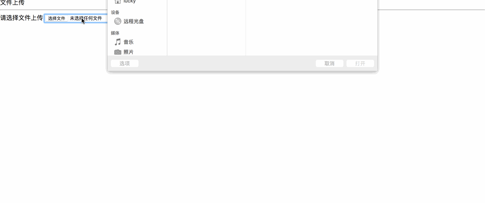

使用`jspsmart`完成文件上传
---

### 用于向服务器上传的表单

```
	<%@ page contentType="text/html;charset=UTF-8" language="java" %>
	<html>
	<head>
	    <title>文件上传</title>
	</head>
	<body>
	文件上传
	<hr>
	
	<%--enctype属性 告诉servlet 表单提交的数据将会被编码并且备多个部分，此时method以定位post--%>
	<form action="servlets/UploadServlet" method="post" enctype="multipart/form-data">
	    请选择文件上传
	    <input type="file" name="myFile">
	    <input type="submit" value="上传">
	</form>
	${msg}
	</body>
	</html>

```

可以看出这个`jsp`中平时的表单还是有些区别的。首先是`enctype`属性。该属性告诉`servlet`这个表单提交的东西会被编码成多个部分，并且其值一定是`multipart/form-data`，同时`method`的值一定是`post`。

### `jspsmart`介绍

- public final void initialize(ServletConfig var1, HttpServletRequest var2, HttpServletResponse var3)

		在进行上传之前，需要进行初始化操作，传入当前 servlet 的 ServletConfig，HttpServletRequst, HttpServletResponse
		
- public void upload()

		初始化完成后，实现上传

- public Files getFiles()

		获取上传的所有的文件对象
		
- public Files getFiles().getFile(i)

		获取上传的所有文件对象的第 i 并返回一个File对象

- public String getFileName()

		得到文件名
- public void saveAs(String var1, int var2) 

		将文件进行保存，参数1是保存的路径，参数2是保存的方式有如下选择
		public static final int SAVE_VIRTUAL = 1; 按照硬盘上的无力路径保存
    	public static final int SAVE_PHYSICAL = 2; 按照网站的虚拟路径保存
    
 
### `Servlet类的实现`

```
/**
 * Project: UploadFile
 * Created by Zdd on 2018/3/14.
 */
public class UploadServlet extends HttpServlet {

    @Override
    protected void doPost(HttpServletRequest req, HttpServletResponse resp) throws ServletException, IOException {
        SmartUpload smartUpload = new SmartUpload();
        ServletConfig config = this.getServletConfig();
//        初始化
        smartUpload.initialize(config, req, resp);
        try {
//            上传文件
            smartUpload.upload();
//            得到上传文件的对象
            File file = smartUpload.getFiles().getFile(0);
            file.saveAs("/Users/lucky/java/java_web_sample/UploadFile/uploadResult/" + file.getFileName(), SmartUpload.SAVE_PHYSICAL);
        } catch (SmartUploadException e) {
            e.printStackTrace();
        }
        String msg="Upload Success";
        req.setAttribute("msg",msg);
        RequestDispatcher requestDispatcher = req.getRequestDispatcher("/index.jsp");
        requestDispatcher.forward(req,resp);
    }
}
```

效果如图所示

